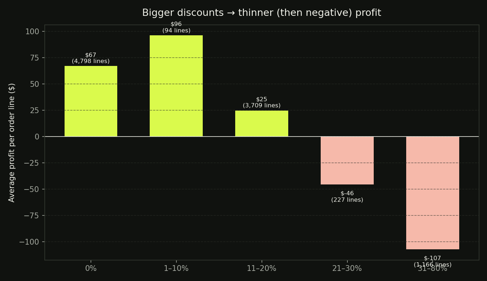
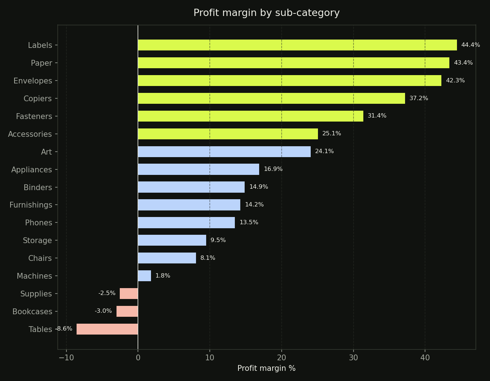
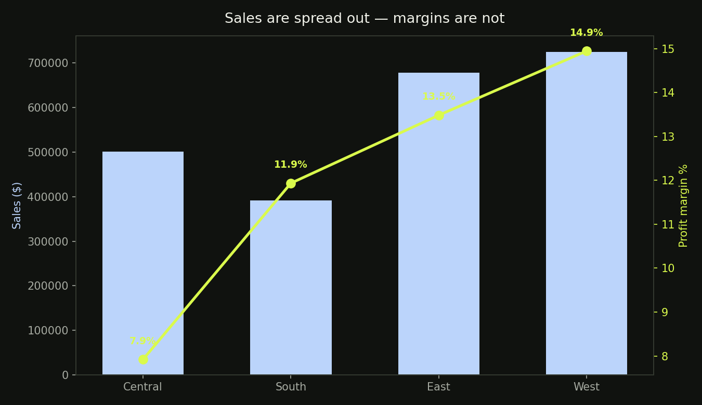
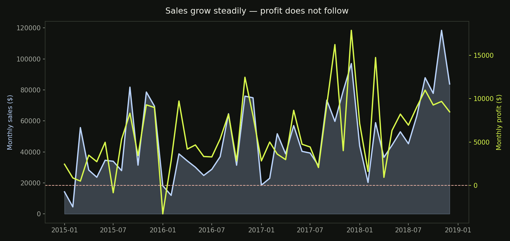

# Retail Profitability Analysis — Where Do Discounts Destroy Margin?

An end-to-end data analysis of 9,994 retail order lines: **SQL** for the business
questions, **Python** for exploration and visualization, and a **Power BI**
dashboard build guide. Every number below was computed from the data — no
placeholders.

## Why this dataset?

I chose the Superstore retail dataset because it looks like the data a real
business analyst works with every day: orders, customers, products, regions,
**sales, discounts, and profit on every line**. It is small enough to reason
about and rich enough to answer questions a retail manager actually asks:

- Which categories make money — and which only look like they do?
- At what discount level do we start *paying* customers to buy?
- Which regions and segments execute best?
- Is profit keeping up with sales growth?

**Data source:** the "Sample – Superstore" dataset (Tableau's bundled sample,
public mirrors on GitHub/Kaggle). Period: **Jan 2015 – Dec 2018**.

> **Data quality note:** the public mirror I used shipped **806 corrupt rows**
> (7.5% of the file) — transposed header fragments like the literal strings
> `'Person'` and `'Region'` sitting in the ID columns with every measure null.
> They were identified and removed before analysis, leaving the canonical
> **9,994 order lines**. Real data is messy; cleaning it is part of the job.
> See `python/analysis.py`.

## What I did

1. **Cleaned & validated** the data in Python (pandas) — corrupt rows removed,
   date parsing checked, duplicates and nulls audited.
2. **Answered 8 business questions in SQL** (`sql/analysis.sql`) — KPIs,
   category margins, discount-vs-profit, loss analysis, regional performance,
   monthly trends, worst products, segment comparison. All queries verified
   against SQLite.
3. **Explored & visualized** in Python (`python/analysis.py`) — 4 charts in
   `images/`.
4. **Designed the executive dashboard** — build guide with data model and DAX
   measures in `powerbi/POWERBI_GUIDE.md`.

## Key findings

**Headline:** $2.30M in sales produced only $286.4K in profit — a **12.47%**
margin across 5,009 orders and 793 customers.

### 1. Discounts are the margin killer
| Discount | Avg profit / line | Lines losing money |
|---|---|---|
| 0% | +$66.90 | 0% |
| 1–10% | +$96.06 | 4.3% |
| 11–20% | +$24.74 | 14.0% |
| 21–30% | **−$45.68** | **91.6%** |
| 31–80% | **−$107.21** | **97.8%** |

- **1,871 order lines (18.7%) lost money**, burning **−$156.1K** in total.
- Loss-making lines carried an average discount of **48.1%** vs **8.1%** on
  profitable lines. The discount *is* the cause, not a coincidence.



### 2. Furniture looks big, earns almost nothing
| Category | Sales | Profit | Margin |
|---|---|---|---|
| Technology | $836.2K | $145.5K | **17.40%** |
| Office Supplies | $719.0K | $122.5K | **17.04%** |
| Furniture | $742.0K | $18.5K | **2.49%** |

Furniture is the second-biggest category by sales and the worst by margin.
Inside it, **Tables lose 8.56%** (−$17.7K) and **Bookcases lose 3.02%**.
Meanwhile the quiet winners — **Labels (44.4%), Paper (43.4%), Envelopes
(42.3%)** — print money at 40%+ margins.



### 3. Same company, four different margins
| Region | Sales | Margin |
|---|---|---|
| West | $725.5K | **14.94%** |
| East | $678.8K | 13.48% |
| South | $391.7K | 11.93% |
| Central | $501.2K | **7.92%** |

Central sells half a million dollars at nearly half the margin of West —
a discounting/execution problem, not a demand problem. Home Office is the
best customer segment (14.03% margin).



### 4. Sales grow; profit doesn't follow
Monthly sales trend up over 4 years, but profit oscillates — **2 of 48 months
went negative** (worst: Jan 2016, −$3.3K). Growth without margin discipline
is just expensive revenue.



### 5. The worst SKUs
The single most destructive product: the **Cubify CubeX 3D Printer (Double
Head)** — **−$8,880 profit on $11,100 of sales** across 3 orders. Its sibling
Triple Head model lost another −$3,840. Heavy discounts on big-ticket
Technology items are the fastest way to lose money in this business.

## Business recommendations

1. **Cap discounts at 20%** — require manager approval above it. Everything
   past 20% loses money 9 times out of 10.
2. **Fix Furniture or shrink it** — renegotiate supplier cost on Tables and
   Bookcases, raise prices, or stop discounting them entirely.
3. **Audit Central region discounting** — same catalogue, half the margin of
   West. Find out who is discounting and why.
4. **Protect the 40%+ margin sub-categories** (Labels, Paper, Envelopes) —
   keep them in stock, never discount them.
5. **Delist or reprice the worst SKUs** — the Cubify printers alone destroyed
   ~$12.7K of profit.

## Repository structure

```
retail-profit-analysis/
├── data/
│   └── superstore.csv          # raw dataset (10,800 rows incl. 806 corrupt — see note)
├── sql/
│   └── analysis.sql            # 8 business-question queries (verified on SQLite)
├── python/
│   └── analysis.py             # cleaning + EDA + chart generation
├── images/
│   ├── discount_vs_profit.png
│   ├── profit_margin_by_subcategory.png
│   ├── region_performance.png
│   └── monthly_trend.png
├── powerbi/
│   └── POWERBI_GUIDE.md        # dashboard build guide: model + DAX measures
└── README.md
```

## How to run

```bash
# 1. Install dependencies
pip install pandas matplotlib numpy

# 2. Run the analysis (cleans data, prints findings, saves charts)
python python/analysis.py

# 3. Run the SQL layer (optional — needs the cleaned CSV)
python3 -c "
import pandas as pd, sqlite3
df = pd.read_csv('data/superstore.csv', encoding='latin-1').dropna(subset=['Sales'])
con = sqlite3.connect('superstore.db'); df.to_sql('orders', con, index=False)"
sqlite3 superstore.db < sql/analysis.sql
```

## Tools
Python (pandas, matplotlib) · SQL (SQLite) · Power BI · Excel-compatible CSV
